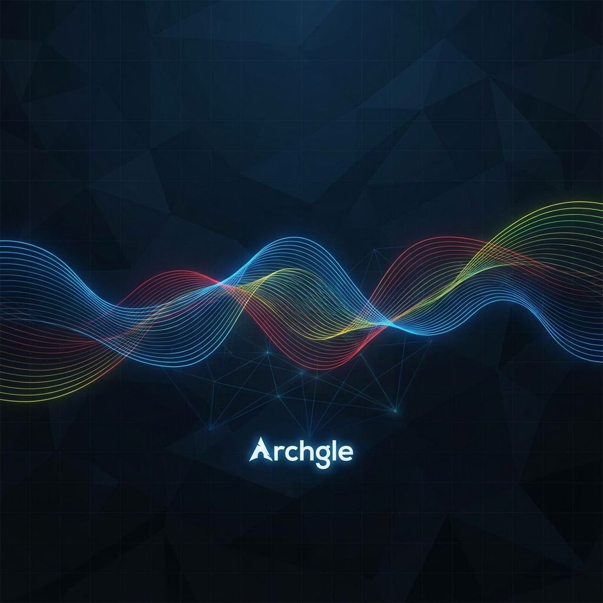

<div align="center">


# Archgle

**Arch Linux + Google Services + AI**

*A customized Arch Linux distribution featuring Google services integration, AI-powered system administration, and beautiful modern desktop environments.*

[](https://archlinux.org/)
[](https://hyprland.org/)
[](https://gnome.org/)
[](https://deepmind.google/technologies/gemini/)

[Features](#-features) • [Installation](#-quick-start) • [Building](#-building-from-source) • [Documentation](#-documentation)

</div>

---

## 🎯 What is Archgle?

Archgle reimagines what a Linux distribution can be when deeply integrated with Google's ecosystem and powered by AI. Built on Arch Linux's solid foundation, Archgle adds:

- **🤖 Agentic AI** - Gemini-powered system assistant at the kernel level
- **🌐 Google Services** - Chrome, Drive, Gmail, Calendar seamlessly integrated
- **⚡ Hardware-Aware** - Automatically optimized for your specific hardware (CPU, GPU, NPU)
- **🎨 Beautiful** - Modern, polished desktop environments with custom themes
- **🔧 Developer-Friendly** - Antigravity IDE, Docker, and cloud tools included

> **Perfect for developers, power users, and anyone who wants the flexibility of Arch with the convenience of Google integration.**

---

## ✨ Features

<table>
<tr>
<td width="50%">

### 🤖 AI Integration

- **AI Daemon** - System monitoring & optimization
- **Google OAuth** - Sign in with Google account
- **AI CLI** - Ask questions, automate tasks
- **Voice Commands** - Optional voice control

```bash
archgle-ai ask "optimize my system"
archgle-ai troubleshoot "wifi issue"
archgle-ai automate "backup to gdrive"
```

</td>
<td width="50%">

### 🌐 Google Services Core

- **Chrome** - Default browser with sync
- **Google Drive** - Auto-mounted at `~/GoogleDrive`
- **Gmail** - GNOME Online Accounts
- **Calendar & Contacts** - Full sync
- **Cloud SDK** - Pre-configured

*All included by default*

</td>
</tr>
<tr>
<td width="50%">

### 🖥️ Modern Desktops

**Hyprland**
- Tiling Wayland compositor
- Smooth animations
- Material Design theme

**GNOME**
- Full-featured desktop
- Google extensions
- Touch-friendly

*Install one or both*

</td>
<td width="50%">

### ⚡ Hardware-Aware

**Automatic optimization for:**
- High-end PCs (max performance)
- Mid-range systems (balanced)
- Low-end hardware (efficiency)

**Full support:**
- GPU: AMD, Intel, Nvidia
- NPU: Intel AI, AMD XDNA

</td>
</tr>
</table>

---

## 🎨 Screenshots

<div align="center">

### Desktop Wallpapers

<table>
<tr>
<td align="center">

<br/>
<b>Material Dark Theme</b>
</td>
<td align="center">

<br/>
<b>AI Abstract Theme</b>
</td>
</tr>
</table>

### Boot Experience


*Custom GRUB theme with Archgle branding*

</div>

---

## 🚀 Quick Start

### Prerequisites

- USB drive (8GB+)
- UEFI system (Secure Boot disabled)
- 8GB+ RAM, 50GB+ storage recommended

### Installation

```bash
# 1. Download latest ISO
wget https://github.com/Spyko2001/Archgle/releases/latest/archgle.iso

# 2. Verify integrity
sha256sum -c archgle.iso.sha256

# 3. Write to USB (Linux)
sudo dd if=archgle.iso of=/dev/sdX bs=4M status=progress oflag=sync

# 4. Boot from USB and run installer
archgle-installer
```

The interactive installer guides you through:
- ✅ Desktop environment selection
- ✅ Theme customization  
- ✅ Security tools (optional)
- ✅ Software recommendations
- ✅ Hardware detection
- ✅ Gemini AI setup

**See [Installation Guide](./docs/INSTALL.md) for detailed instructions**

---

## 🔧 Building from Source

### Requirements

- Arch Linux environment (VM, container, or native)
- 50GB free space
- `archiso` package

### Build Commands

```bash
# Clone repository
git clone https://github.com/Spyko2001/Archgle.git
cd Archgle

# Install dependencies
sudo pacman -S archiso

# Build ISO
cd build
sudo ./build-iso.sh

# Output: ../out/archgle-YYYY.MM.DD-x86_64.iso
```

**See [Build Guide](./docs/BUILD.md) for Hyper-V setup and detailed instructions**

---

## 📚 Documentation

| Document | Description |
|----------|-------------|
| [Features](./docs/FEATURES.md) | Complete feature list and capabilities |
| [Build Guide](./docs/BUILD.md) | Build your own ISO (Hyper-V instructions) |
| [Installation](./docs/INSTALL.md) | Detailed installation walkthrough |
| [Project Vision](./docs/archgle.md) | Philosophy and design goals |

---

## 🆚 Comparison

| Feature | Archgle | Vanilla Arch | Ubuntu | Manjaro |
|---------|:-------:|:------------:|:------:|:-------:|
| Interactive Installer | ✅ | ❌ | ✅ | ✅ |
| Google Integration | ✅ | ❌ | ❌ | ❌ |
| AI Assistant | ✅ | ❌ | ❌ | ❌ |
| Hardware-Aware Optimization | ✅ | ❌ | ⚠️ | ⚠️ |
| Rolling Release | ✅ | ✅ | ❌ | ✅ |
| AUR Access | ✅ | ✅ | ❌ | ✅ |
| GPU/NPU Support | ✅ | ⚠️ | ⚠️ | ⚠️ |
| Beautiful Defaults | ✅ | ❌ | ⚠️ | ✅ |

---

## 🎯 Who is Archgle For?

<table>
<tr>
<td width="50%">

### ✅ Perfect For

- **Google ecosystem users** - Seamless integration
- **Developers** - Antigravity IDE, Docker, cloud tools
- **AI enthusiasts** - Gemini API, NPU acceleration
- **Power users** - Arch flexibility, easy setup
- **Security pros** - Optional pentesting toolkit

</td>
<td width="50%">

### 💡 Great For

- Daily productivity
- Software development
- Content creation
- System administration
- Cloud computing
- Gaming (Steam, Lutris)

</td>
</tr>
</table>

---

## 🛠️ Project Structure

```
Archgle/
├── archiso/                  # ISO build configuration
│   ├── profiledef.sh         # Build settings
│   ├── packages.x86_64       # 200+ packages
│   └── pacman.conf           # Package manager config
│
├── installer/                # Interactive TUI installer
│   └── archgle-installer.sh
│
├── scripts/                  # System scripts
│   ├── ai/                   # AI daemon & CLI
│   ├── google-services-setup.sh
│   └── performance-tweaks.sh
│
├── configs/                  # System configurations
│   ├── ai/                   # AI daemon service
│   ├── hyprland/             # Hyprland config
│   └── software/             # Package categories
│
├── themes/                   # Custom branding
│   ├── logo.png
│   ├── wallpapers/
│   └── grub/
│
└── docs/                     # Documentation
```

---

## 🤝 Contributing

Contributions are welcome! Here's how you can help:

- ⭐ **Star** this repository
- 🐛 **Report bugs** via [Issues](https://github.com/Spyko2001/Archgle/issues)
- 💡 **Suggest features** in [Discussions](https://github.com/Spyko2001/Archgle/discussions)
- 🔧 **Submit PRs** to improve code, docs, or themes
- 📢 **Share** Archgle with the community

---

## 📜 License

This project is licensed under the **MIT License** - see [LICENSE](LICENSE) for details.

---

## ⚠️ Important Notes

> [!WARNING]
> **Not affiliated with Google** - Archgle is an independent open-source project

> [!CAUTION]
> **Security Tools** - Use responsibly and only on systems you own or have permission to test

> [!NOTE]
> **Experimental** - Archgle is under active development. Test in a VM before daily use.

---

## 🙏 Acknowledgments

Built with ❤️ for the community and powered by:

- [Arch Linux](https://archlinux.org/) - The foundation
- [Google](https://google.com) - Services and AI
- [Hyprland](https://hyprland.org/) - Beautiful compositor
- [GNOME](https://gnome.org/) - Desktop environment
- The entire open-source community

---

<div align="center">

### 🚀 **Archgle: Where Arch Linux meets Google, powered by AI**

Made with ❤️ by [Spyro](https://github.com/Spyko2001)

[⬆ Back to Top](#archgle)

</div>
